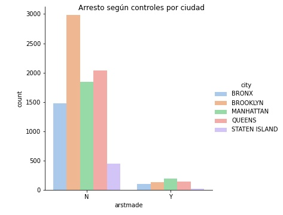
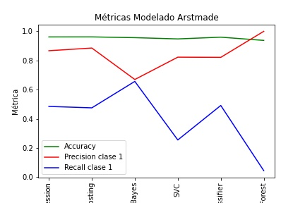
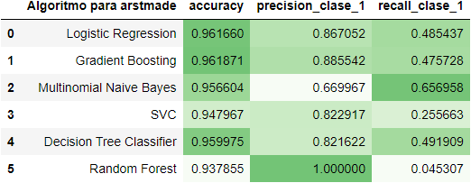
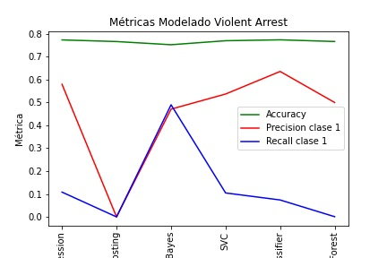
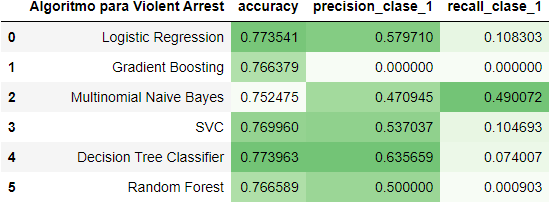

# Contexto
<!--
Para ingresar una imagen

-->

Este dataset se creo en Nueva York, a través del programa stop and frisk, en el que realizaban detenciones e interrogaciones en la vía pública, este Dataset son muestras hechas en el año 2009 y 2010.

Este problema se divide en dos:
* El primero es crear un modelo que prediga si una persona será arrestada durante un control policial.
* El segundo es crear un modelo predictivo que determine según las características de los detenidos, si el procedimiento será **violento** o no.

# Solución

## Análisis exploratorio de los datos
* ***Datasets***
Se cuenta con dos datasets, ambos con la misma información para los años 2009 y 2010.

  * Datos 2009: 111 columnas y 5812 registros.

  * Datos 2010: 111 columnas y 6013 registros.

  Los cuales se limpiaron y consilidaron en un dataset llamado `stop_and_frisk.csv` y se analizó para ver cómo se comportan los datos.

  * Tipos de datos: Una vez limpio los datos se puede observar que el *97.4%* de ellos es de tipo categórico y solo el *2.6%* es de tipo numérico. A pesar de que se pueden tratar para pasarlas a valores numéricos, para que puedan ser usadas en los modelos de machine learning, son demasiados valores categóricos, por lo que veremos finalmente si los resultados obtenidos son de buena calidad, para tener conclusiones de peso.

* ***Vector objetivo artmade:*** Determina si la detención policial termina en arresto o no.

  

  Del total de controles policiales, un 6.3% de ellos terminaron en un arresto, lo que significa que de cada 100 cotroles en 6 de ellos hay un arrestado.

* ***Controles y detenidos por ciudad:*** Veamos los controles según las ciudades donde fueron hechos y los arrestados
Si Desglosamos estos detenidos por la ciudad en la que fueron arrestados.

  

  * La mayor cantidad de controles se realizaron en ***Brooklyn y Queens*** y la ciudad que menos controles tuvo, fue ***Staten Island***.
  * Hay un country llamado `STATEN IS`, que es lo mismo que `STATEN ISLAND`, por lo cual hay que corregirlo.

* ***Controles en cuanto a la raza y sexo de los controlados:*** Veamos la raza y el sexo de las personas controladas.
  

  * Del total de personas que son **controladas**, la mayoría son de raza ***Negra*** e ***Hispanos blancos***, seguidas de ***Hispanos negros***, ya muy por debajo se encuentras todas las demás razas, resaltando también aunque minoritaria, el control a ***Blancos*** e ***Hispanos negros***.
  * Pasando ahora a los que son **arrestados**, nos encontramos con el mismo panorama, se detienen principalmente a personas de raza ***Negra*** e ***Hispanos blancos***.

  Ya con estos antecedentes, podemos ver una clara tendencia de que los datos recopilados están sesgados de una forma racista, no se controla a la gente por igual, tienen una clara tendencia a controlar a personas negras e hispanas, por lo que probablemente los resultados de los modelos que puedan salir de analizar esta información, sean también sesgado. Por lo que tendremos que tener mucho cuidado en la ética del análisis que realizemos.

  Aunque este fenómeno puede darse también porque las zonas en donde se implementó el programa 'stop and frisk' tenga población mayoritariamente de estos grupos étnicos.

## Feature Engieneering

Se realizaron una serie de trabajos con las variables de dataset, como eliminar las variables que sólo tenian un tipo de dato, también la variable `beat`, que tenía 63 tipos diferentes de datos y además el 63% de ellos eran desconocidos.

Un arreglo importante, fue la ***creación de la variable*** `violent_arrest`, para responder a la segunda problemática sobre crear un modelo predictivo que determine según las características de los detenidos, si el procedimiento será **violento** o no.

Sucede que todas esas columnas que comienzan por ***`pf_`*** hacen alusión a un tipo de detención usando fuerza física por parte del oficial, por lo cual los uniremos en una categoría llamada ***violent_arrest***, en donde si un detención tiene presente al menos uno de estos factores, será catalogado como violento.

De esta manera podremos eliminar todas estas columnas, para dejar presente sólo la detención violenta.

Como resultado de la creación de esta variable, tenemos que del total de detenciones, un **23.9%** fueron realizadas de manera violenta utilizando **fuerza física**.

En otras palabras 1 de cada 4 controles fueron realizados de forma violenta por los oficiales.

## Modelado

### **Modelado del problema 1**
Recordemos que este problema tiene como vector objetivo `arstmade`, el cual indica si la persona fue arrestada o no. 

  * ***¿Realizamos Oversampling?***: Recordemos que tenemos vectores objetivos desbalanceados, por lo cual se probó se realizar un oversampleo (aumentar de manera artificial la clase minoritaria) mejoraría nuestros modelos.

  
  
  

  Una vez realizado esto, las métricas no fueron favorables (ver notebook) por lo que decidí continuar la modelación **sin utilizar oversampling**.

* ***Modelos a probar***

  Los algoritmos de machine learning a probar, fueron:

  * Logistic Regression.
  * Gradient Boosting.
  * Multinomial Naive Bayes.
  * Support Vector Machine.
  * Random Forest.

  Para la resolución del problema, primero se utilizaron grillas de búsqueda de los mejores hiperparámetros para cada modelo, y luego se alicaron los modelos, separando la data en dos cojuntos:
  
  * Training Data: Se utilizaron los datos del año 2009.
  * Testing Data: Se utilizaron los datos del año 2010.

  Cabe destacar que estos modelos, además de las grillas de búsqueda de hiperparámetros utilizadas, fueron las mismas para **ambos problemas**.

* ***Resultados de métricas problema 1***

  

  

* ***Conclusiones Modelado 'Arstmade'***

  En cuanto al **accuracy** de los modelos, es muy similar en todos, entre 0.94 y 0.96, por lo que no nos dice mucho acerca del comportamiento, en donde tenemos que tener especial cuidado es en la **precision**, ya que el **costo de un Falso Positivo es alto**, y con esto nos referimos a que arrestar a una persona que no cometió un delito es algo **muy grave**.

  Una vez aclarado lo de la precision, los dos mejores modelos son:
  * **Logistic Regression**
  * **Gradient Boosting**

  Estos modelos son los que logran capturar de mejor manera los Verdaderos Positivos, sin bajar tanto el **recall**.

  Por otra parte el modelo que mejor precision tiene, es Random Forest, pero tiene practicamente 0 de recall, lo cual lo hace muy desequilibrado.

### **Modelado del problema 2**
Recordemos que este problema tiene como objetivo crear un modelo predictivo que determine según las características de los detenidos, si el procedimiento será **violento** o no, por lo que trabajaremos con nuestra vector objetivo `violent_arrest` creado especialmente para capturar este fenómeno.

* ***Resultados de métricas problema 2***

  

  

* ***Conclusiones Modelado 'violet_arrest'***

  A nivel de accuracy están todos situados en los mismos niveles, entre 0.75 y 0.77, por lo que no nos sirve para decidir que modelo es mejor.

  Pasando ahora a **precision y recall**, son resultados deficientes, en su mayoría por debajo de 0.5, por lo que no podemos obtener resultados consistentes, aun asi, si tenemos que escoger los 2 mejores, estos serían:
  * **Multinomial Naive Bayes**
  * **Logistic Regression**

  Siendo Multinomial Naive Bayes el mejor, que a pesar de tener el accuracy más bajo (0.75), tiene un equilibrio entre **precision (0.47) y recall (0.49)**.

# Conclusiones Generales

Bien es sabido que en EEUU, la policía es racista a la hora de hacer detenciones o detenciones violentas, teniendo casos tan emblemáticos, como el de [**George Floyd**](https://es.wikipedia.org/wiki/Muerte_de_George_Floyd) el 25 de Marzo del 2020. Sus detenciones violentas son hechas principalmente a personas de raza negra, hispanos y latinos.

Es por esto, que este dataset posee estos mismos sesgos, por lo que **tenemos que tomar con pinzas** los resultados obtenidos aquí, recordemos que un algoritmo de machine learning estará sesgado, si la base de datos sobre la cual trabaja lo esta.

Por otra parte en cuanto a los datos y la calidad de estos como dijimos en un inicio, el **95.3%** de las variables son **categóricas**, por lo que tal vez no sea el mejor dataset para realizar este tipo de análisis, las **métricas obtenidas fueron muy pobres**.