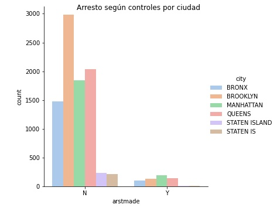

# 1. Contexto
<!--
Para ingresar una imagen

-->

Este dataset se creo en Nueva York, a través del programa stop and frisk, en el que realizaban detenciones e interrogaciones en la vía pública, este Dataset son muestras hechas en el año 2009 y 2010.

Este problema se divide en dos:
* El primero es crear un modelo predictivo que nos diga la probabilidad de que una persona sea arrestada en una detención.
* El segundo es crear un modelo predictivo que determine según las características de los detenidos, si el procedimiento será **violento** o no.

# 2. Solución

Para implementar una solución se necesitan hacer los siguientes pasos:
* Análisis exploratorio: Para saber como se comportan los datos.
* Limpieza de datos: Aqui tenemos mucho que hacer, hay 22 columnas con datos perdidos, teniendo 15 de ellas, con más de 3200 datos perdidos, por lo que lo más conveniente es eliminar estas columnas, ya que si les hacemos un dropna, peremos más del 50% de los datos.
Además tenemos varias variables categóricas que debemos binarizar, ya que los algoritmos de ML, no las soportan, debemos tener todo numérico.
* Modelado: Una vez tenemos todos los datos limpios, podemos comenzar a trabajar con modelos de ML que nos permitan hacer predicciones en este problema de clasificación.
* Evaluación: Evaluaremos los diferentes modelos y nos quedaremos con el que mejor métricas de desempeño nos otorgue.

Solución:
* Para responder al primer objetivo, que es la limpieza de datos, luego de el análisis exploratorio, nos encontraremos que varias columnas deben ser eliminadas o tratadas, para hacerle frente a los casos perdidos.
* Necesitaremos hacer 5 modelos de clasificación, con el cual predeciremos si una persona si un procedimiento concluirá en arresto o no. Esto lo podemos hacer a través de diferentes algoritmos, como por ejemplo:
  * Random Forest
  * Regresión logística
  * Adaptive Boost
  * Gradient Boost
  * SVM
  * etc
* Una vez terminados nuestros modelos, implementaremos una grilla de búsqueda de hiperparámetros, con el fin de obtener los mejores hiperparámetros para nuestros modelos y refinarlos
* Una vez ya tuneados nuestros modelos, los evaluaremos y veremos cuales de estos son los mejores tanto a nivel de resultados previstos, como también que sean eficientes computacionalmente hablando.

* Métricas de desempeño: Al ser esos modelos de clasificación, las métricas de desempeño a utilizar, serán:
  * Classification report
      * Error tipo 1
      * Error tipo 2
      * Precision
      * Recall
      * F1-score
      * accuracy
  * Confussion Matrix
